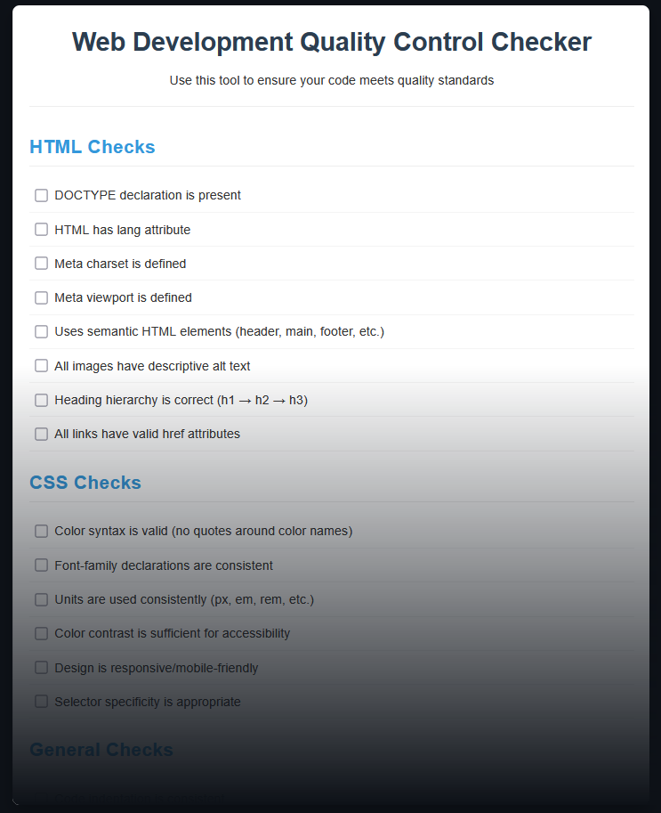

# Web Development Quality Control Checker

A simple, interactive tool to help web developers ensure their code follows best practices and quality standards.



## Overview

The Web Development Quality Control Checker is a lightweight web application designed to help beginners and intermediate developers maintain consistent quality in their HTML and CSS code. It provides a comprehensive checklist of best practices that can be used to review code and identify areas for improvement.

## Features

- **Comprehensive Checklists**: Separate sections for HTML, CSS, and general coding practices
- **Interactive Progress Tracking**: Real-time progress bar and status updates
- **User-Friendly Interface**: Clean, responsive design that works on all devices
- **Self-Contained**: No external dependencies or installation required

## Installation

1. Clone this repository:
   ```
   git clone https://github.com/yourusername/web-dev-qc-checker.git
   ```

2. No build process or installation needed - simply open `index.html` in your browser.

## Usage

1. Open the application in your web browser
2. Review your code against each item in the checklist
3. Check off each item that your code complies with
4. Monitor your progress with the visual progress bar
5. Use the reset button when starting a new code review

## Project Structure

```
web-dev-qc-checker/
│
├── index.html          # Main HTML structure
├── styles.css          # CSS styling
├── script.js           # JavaScript functionality
└── README.md           # This documentation
```

## Customization

The checklist can be easily extended or modified to include additional quality checks:

1. Add new list items to the appropriate section in `index.html`
2. Update the JavaScript to account for the new total number of checks (automatic if using the provided script)
3. Add any specialized styling for new elements if needed

## Learning Resources

If you're unsure about any of the quality checks mentioned in the tool, here are some helpful resources:

- [MDN Web Docs](https://developer.mozilla.org/en-US/)
- [W3C HTML Validator](https://validator.w3.org/)
- [W3C CSS Validator](https://jigsaw.w3.org/css-validator/)
- [Web Accessibility Initiative (WAI)](https://www.w3.org/WAI/)

## Contributing

Contributions are welcome! If you'd like to add features or suggest improvements:

1. Fork the repository
2. Create your feature branch (`git checkout -b feature/amazing-feature`)
3. Commit your changes (`git commit -m 'Add some amazing feature'`)
4. Push to the branch (`git push origin feature/amazing-feature`)
5. Open a Pull Request

## License

This project is licensed under the MIT License - see the LICENSE file for details.

## Acknowledgments

- Inspired by common web development best practices
- Created to help new developers build good coding habits

---

Created with ❤️ by Vreemde Piesang 
